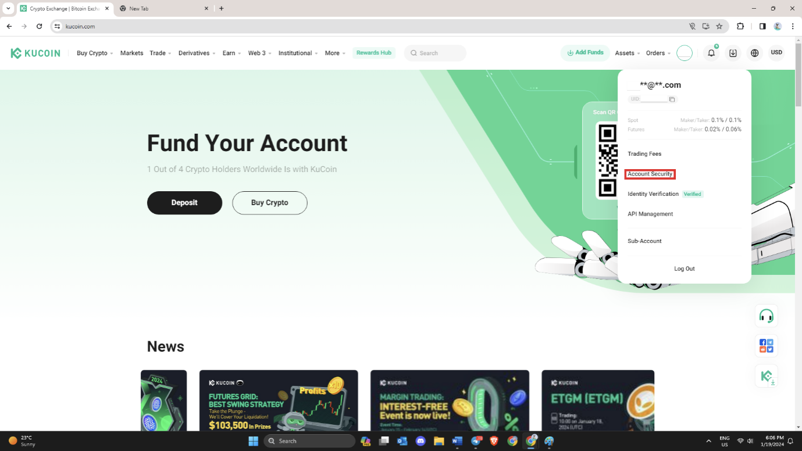

# Kucoin.com (KYC)

Check ["Restricted Countries"](https://www.kucoin.com/legal/terms-of-use) here (Article 17 (5)).

Once verified, here is a simple step by step guide to setup the API connection for Kucoin.

1\. Navigate to the drop down menu on your account icon and click on “Account Security”.

<figure><figcaption></figcaption></figure>

2\. When in “Security Settings”, you must bind 2 of 3 of the options, either Email, Phone or Google Verification. Once you have done this click on Trading Password and Set your 6-digit Trading Password (This will be used to help set up your API connection).\
\
Once complete, click on the “API Management” on the sidebar to set up the API connection.

<figure><figcaption></figcaption></figure>

3\. Click on “Create API”&#x20;

<figure><figcaption></figcaption></figure>

4\. From top to bottom complete marked fields. Click Next when complete.\
\
\*\*Note\*\*:&#x20;

* When choosing API Passphrase, do not use numbers or special characters \[!@#$%^&\*()\_+].
* Remember your passphrase as you will need it later when entering details in to the bot.
* Type of trading is up to you.

<figure><figcaption></figcaption></figure>

5\. Enter your 6-digit Trading Password you had set in Step 2, and an SMS verification code. Click “Confirm”.

<figure><figcaption></figcaption></figure>

6\. Your API has been created! Copy and Paste both your “Key” and “API Secret”, and along with your API Passphrase you will use them to set up the exchange on your bot to link with your KuCoin Trading Account.

\*\*Note\*\*: Once you click “Confirm”, The Secret will disappear, so be sure to copy and paste on to somewhere you can leave it.&#x20;

<figure><figcaption></figcaption></figure>
